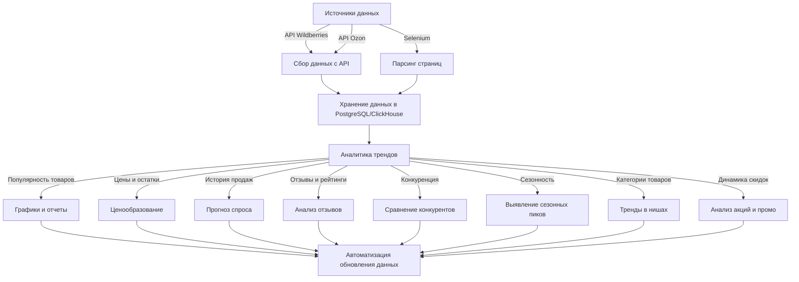

# DataPulse
анализ данных в реальном времени


Привет! Начни с четкого плана сбора данных. Поскольку ты хочешь анализировать **Wildberries и Ozon**, рекомендую следующий подход:

### 1. **Определись с целями**
- Какие метрики тебе важны? (цены, спрос, остатки товаров, рейтинги, тренды)
- Как часто нужно обновлять данные? (ежедневно, раз в час, в реальном времени)

### 2. **Выбери источник данных**
- **Официальные API** (если есть доступ) – проще и надежнее.
- **Веб-скрейпинг** – если API нет или он ограничен.
- **Открытые источники** – статистика продаж, данные маркетинговых отчетов.

### 3. **Настройка парсинга (если API нет)**
- Определи нужные страницы (каталоги, карточки товаров, поисковые запросы).
- Выбери инструмент:
    - **Scrapy (Python)** – мощный, подходит для больших объемов.
    - **Selenium (Python)** – если нужно рендерить JavaScript.
    - **Cheerio (Node.js)** – легковесный, если данные уже в HTML.
    - **PHP Simple HTML DOM** – если хочешь сделать парсер на PHP.

### 4. **Спроектируй базу данных**
- **PostgreSQL** – основная БД.
- **ClickHouse** – для быстрого анализа больших объемов данных.
- **Aerospike** – кеширование часто используемых данных.

### 5. **Начни с малого**
- Попробуй спарсить несколько страниц и записать в БД.
- Анализируй, достаточно ли данных.
- Оптимизируй процесс и добавляй новые источники.

Можешь сначала попробовать **API Ozon**, там есть доступ к каталогу и аналитическим данным. Если хочешь, могу помочь с выбором подходящего инструмента и структурой данных!




Вот несколько полезных **SQL-запросов** для анализа трендов продаж в **PostgreSQL** и **ClickHouse**.

---

## **1. Анализ динамики продаж (количество продаж за период)**
Этот запрос покажет **количество продаж по дням**:

### **PostgreSQL:**
```sql
SELECT date_trunc('day', sale_date) AS day, 
       COUNT(order_id) AS total_sales
FROM sales_data
GROUP BY day
ORDER BY day DESC;
```

### **ClickHouse:**
```sql
SELECT toStartOfDay(sale_date) AS day, 
       count() AS total_sales
FROM sales_data
GROUP BY day
ORDER BY day DESC;
```

📊 **Что показывает?**
- Как меняется число продаж по дням.
- Можно выявить пики и спады.

---

## **2. Анализ сезонности (сравнение продаж по месяцам)**
### **PostgreSQL:**
```sql
SELECT date_trunc('month', sale_date) AS month, 
       COUNT(order_id) AS total_sales
FROM sales_data
GROUP BY month
ORDER BY month DESC;
```

### **ClickHouse:**
```sql
SELECT toStartOfMonth(sale_date) AS month, 
       count() AS total_sales
FROM sales_data
GROUP BY month
ORDER BY month DESC;
```

📊 **Что показывает?**
- Какие месяцы наиболее прибыльные.
- Можно выявить сезонные товары.

---

## **3. Анализ ценовых трендов (средняя цена товара по времени)**
### **PostgreSQL:**
```sql
SELECT date_trunc('day', price_date) AS day, 
       product_id, 
       AVG(price) AS avg_price
FROM price_history
GROUP BY day, product_id
ORDER BY day DESC;
```

### **ClickHouse:**
```sql
SELECT toStartOfDay(price_date) AS day, 
       product_id, 
       avg(price) AS avg_price
FROM price_history
GROUP BY day, product_id
ORDER BY day DESC;
```

📊 **Что показывает?**
- Как менялась цена товаров по дням.
- Можно отследить динамику скидок.

---

## **4. Топ продаваемых товаров**
### **PostgreSQL:**
```sql
SELECT product_id, 
       COUNT(order_id) AS sales_count
FROM sales_data
GROUP BY product_id
ORDER BY sales_count DESC
LIMIT 10;
```

### **ClickHouse:**
```sql
SELECT product_id, 
       count() AS sales_count
FROM sales_data
GROUP BY product_id
ORDER BY sales_count DESC
LIMIT 10;
```

📊 **Что показывает?**
- Самые продаваемые товары.

---

## **5. Анализ отзывов (средний рейтинг товара)**
### **PostgreSQL:**
```sql
SELECT product_id, 
       AVG(rating) AS avg_rating, 
       COUNT(review_id) AS total_reviews
FROM reviews
GROUP BY product_id
ORDER BY avg_rating DESC
LIMIT 10;
```

### **ClickHouse:**
```sql
SELECT product_id, 
       avg(rating) AS avg_rating, 
       count() AS total_reviews
FROM reviews
GROUP BY product_id
ORDER BY avg_rating DESC
LIMIT 10;
```

📊 **Что показывает?**
- Какие товары имеют **высокий рейтинг**.
- Можно определить **популярные и проблемные товары**.

---

## **6. Товары с падением продаж (анти-тренды)**
### **PostgreSQL:**
```sql
WITH sales_trend AS (
    SELECT product_id, 
           date_trunc('month', sale_date) AS month, 
           COUNT(order_id) AS sales_count
    FROM sales_data
    GROUP BY product_id, month
)
SELECT product_id, 
       sales_count AS current_sales,
       LAG(sales_count) OVER (PARTITION BY product_id ORDER BY month) AS previous_sales
FROM sales_trend
ORDER BY (previous_sales - current_sales) DESC
LIMIT 10;
```

📊 **Что показывает?**
- Какие товары **теряют популярность**.

---

### **Что дальше?**
🔥 **Эти SQL-запросы помогут анализировать данные в реальном времени.**  
💡 **Хочешь добавить автоматизацию? Можно настраивать обновление данных раз в день!** 🚀